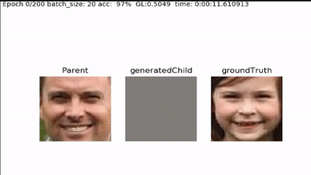
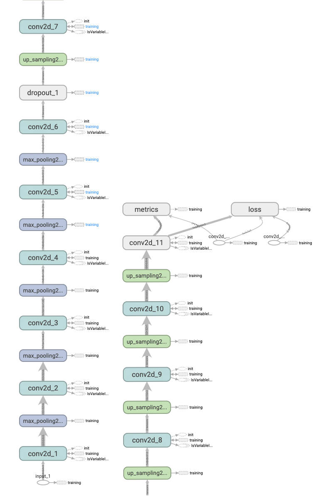

 

Child-Face-Generator 
 ================
Generate Child from people image with Keras Tensorflow
with
Simple autoencoder predictor  
 


Architecture 
------------

 


```
_________________________________________________________________
Layer (type)                 Output Shape              Param #   
=================================================================
input_1 (InputLayer)         (None, 64, 64, 3)         0         
_________________________________________________________________
conv2d_1 (Conv2D)            (None, 64, 64, 64)        1792      
_________________________________________________________________
max_pooling2d_1 (MaxPooling2 (None, 32, 32, 64)        0         
_________________________________________________________________
conv2d_2 (Conv2D)            (None, 32, 32, 64)        36928     
_________________________________________________________________
max_pooling2d_2 (MaxPooling2 (None, 16, 16, 64)        0         
_________________________________________________________________
conv2d_3 (Conv2D)            (None, 16, 16, 128)       73856     
_________________________________________________________________
max_pooling2d_3 (MaxPooling2 (None, 8, 8, 128)         0         
_________________________________________________________________
conv2d_4 (Conv2D)            (None, 8, 8, 256)         295168    
_________________________________________________________________
max_pooling2d_4 (MaxPooling2 (None, 4, 4, 256)         0         
_________________________________________________________________
conv2d_5 (Conv2D)            (None, 4, 4, 512)         1180160   
_________________________________________________________________
max_pooling2d_5 (MaxPooling2 (None, 2, 2, 512)         0         
_________________________________________________________________
conv2d_6 (Conv2D)            (None, 2, 2, 1024)        4719616   
_________________________________________________________________
dropout_1 (Dropout)          (None, 2, 2, 1024)        0         
_________________________________________________________________
up_sampling2d_1 (UpSampling2 (None, 4, 4, 1024)        0         
_________________________________________________________________
conv2d_7 (Conv2D)            (None, 4, 4, 512)         4719104   
_________________________________________________________________
up_sampling2d_2 (UpSampling2 (None, 8, 8, 512)         0         
_________________________________________________________________
conv2d_8 (Conv2D)            (None, 8, 8, 256)         1179904   
_________________________________________________________________
up_sampling2d_3 (UpSampling2 (None, 16, 16, 256)       0         
_________________________________________________________________
conv2d_9 (Conv2D)            (None, 16, 16, 128)       295040    
_________________________________________________________________
up_sampling2d_4 (UpSampling2 (None, 32, 32, 128)       0         
_________________________________________________________________
conv2d_10 (Conv2D)           (None, 32, 32, 64)        73792     
_________________________________________________________________
up_sampling2d_5 (UpSampling2 (None, 64, 64, 64)        0         
_________________________________________________________________
conv2d_11 (Conv2D)           (None, 64, 64, 3)         3075      
=================================================================
Total params: 12,578,435
Trainable params: 12,578,435
Non-trainable params: 0

```

* modify data_loader.py from https://github.com/eriklindernoren/Keras-GAN

Requirements 
------------
- Python
- Dataset From http://www.kinfacew.com/


Setup package
------------

 

### Install pip depedency

```bash
pip install -r requirements.txt 
```

Training 
------------

```bash
python autoencoder.py
```

 
 
